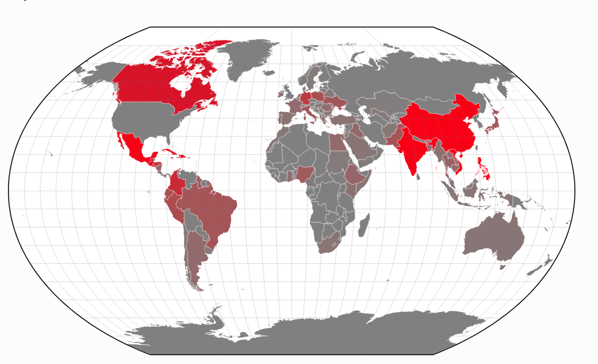
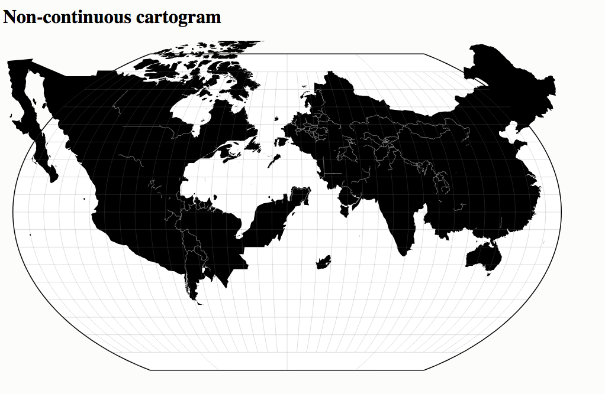

# Quick And Dirty Data Visualization
## World map visualizations with D3.js
### Normalizing the data (Excel)
Starting point: https://bl.ocks.org/mbostock/4180634
I started with some example code and an SVG of a world map from this site.

The countries on the map are indexed by its ISO 3166-1 code. In order to match the country names in the provided dataset on immigrants with the relevant ISO codes, I used the VLOOKUP function in Excel. I started by creating a sheet with the provided dataset, and another sheet with a list of countries and their ISO codes. 

The basic forumula I used is =VLOOKUP(A2,Sheet1!A:B,2,FALSE) where A2 is the name of the country I want to find the code for. Sheet1!A:B is the range of cells containing the country names and ISO codes. The third parameter ("2") indicates which column in the source dataset contains the ISO codes to grab. The last parameter ("FALSE") specifies that I want to only find an exact match.

The dataset has a number of geographic areas which don't map to a country, which for the purposes of this assignment I will ignore. 

I ended up with the following:

| country                                               | countrycode | estimate | marginOfError | 
|-------------------------------------------------------|-------------|----------|---------------| 
| Northern Europe                                       | #N/A        | 928644   | 16770         | 
| United Kingdom (inc. Crown Dependencies)              | #N/A        | 683473   | 13753         | 
| United Kingdom excluding England and Scotland         | #N/A        | 310243   | 9571          | 
| England                                               | #N/A        | 319734   | 9589          | 
| Scotland                                              | #N/A        | 53496    | 3645          | 
| Ireland                                               | 372         | 120144   | 6262          | 
| Denmark                                               | 208         | 29039    | 2609          | 
| Norway                                                | 578         | 24982    | 2645          | 
| Sweden                                                | 752         | 46335    | 3628          |
etc, etc, etc

### First Roadblock
Bringing multiple data sources into D3 is more complicated than I thought it would be. It's definitely a different programming paradigm than I'm used to (coming from a world of jQuery, SQL and PHP). I determined that the easiest way would be to paste my data (in JSON form) directly into my JS. I converted it from my Excel file using one of the many online tools to do this. 

### A solution (but not THE solution)
In order to link the first data source (World map SVG/JSON indexed by country code) with the second data source (my spreadhseet which has country codes and estimates), I put my logic in the Fill function (which was part of the example code). This function loops through all of the countries on the map. On each iteration, I used the JS Array.find() function to look through the data and see if the country code matched. 

If we matched with one of the country codes, I calculated a fraction by dividing the estimate for that country by the total number of immigrants. (to find the total I looped through all the data and incremented a counter for each row at the beginning of my script)

To translate that fraction into a useful color, I utilized D3's linear scale function -- it maps a domain and range of data onto a range of colors and it seems to be smart as heck: 
```
var color = d3.scale.linear()
            .range(["gray", "red"]);
```
And then in my fill function:
```
return color(fraction);
```

Honestly I don't totally understand how this works within D3's declarative paradigm, but I was very suprised when it "just worked" when I pasted in a snippet I found in the docs.



## Another world map visualization: Non-Contigous Cartogram
Starting point: https://bl.ocks.org/mbostock/4055908

After a bit of playing around with porting the example code for a U.S. map to the world map, I made some progress




